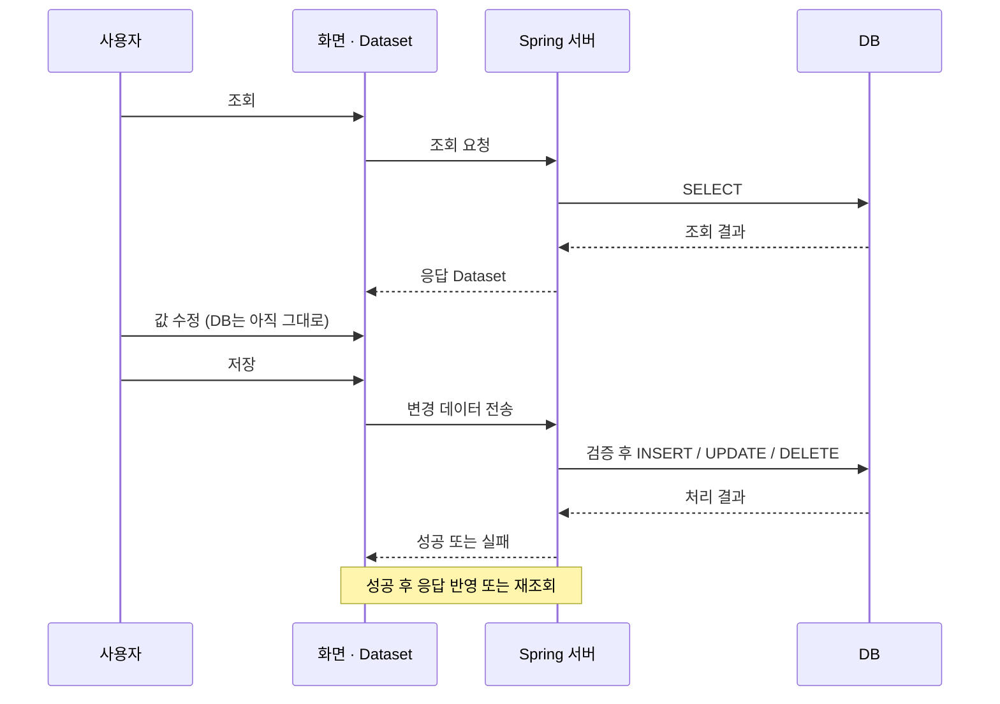

# Dataset 계약·행 상태·저장 후 동기화

[매뉴얼 목차](../README.md) · 관련 문서: [Dataset 설계](../basics/data/dataset-design.md) / [DB 동기화](../basics/communication/data-sync.md)

조회용 컬럼과 저장 데이터를 설계하거나 삭제·재조회·동시 수정 문제를 다룰 때 읽습니다.

## DB 테이블과 똑같이 만들면 되나요?

**화면과 API가 필요한 데이터 기준으로 설계합니다.** DB의 여러 테이블을 조인한 결과를 하나의 Dataset으로 받을 수 있고, 화면 체크 여부처럼 DB에 저장하지 않는 컬럼을 둘 수도 있습니다.

| 예시 Dataset | 용도 | 설계 기준 |
| --- | --- | --- |
| `ds_search` | 조회 조건 | 부서 코드·검색어 등. 한 행을 쓰는 방식도 흔함 |
| `ds_emp` | 사원 목록과 수정값 | 사번·이름·부서 코드·급여 등 |
| `ds_dept` | 부서 선택지 | 코드와 표시명 |

아래는 사원 조회·저장 계약을 설계할 때의 예입니다. 실제 컬럼명은 서버와 일치시킵니다.

| 컬럼 | 예시 타입 | 설계 시 결정할 내용 |
| --- | --- | --- |
| EMPL_ID | STRING | 사원 식별자. 앞자리 0 보존, 신규 발급 주체 |
| FULL_NAME | STRING | 최대 길이, 필수 여부, 빈 문자열 처리 |
| DEPT_CD | STRING | 부서 코드. 표시명과 구분 |
| SALARY | 숫자 타입 | 범위·소수점·정밀도. INT/FLOAT/BIGDECIMAL 등 계약에 맞게 선택 |
| HIRE_DATE | DATE 또는 STRING | 날짜 타입인지 `yyyyMMdd` 같은 문자열인지 합의 |
| SELECTED | STRING 등 | 화면 선택용인지 서버 저장 대상인지 구분 |

먼저 **식별자 → 컬럼명·타입·길이 → null·날짜·코드 표현 → 조회용/저장용 구분**을 정하면 됩니다. Dataset에 컬럼이 있다고 필수값·유일성·외래키가 DB처럼 보장되지는 않습니다. 업무 검증은 화면과 서버에 구현합니다.

## Studio에서는 어떻게 정의하나요?

Dataset을 Form에 추가하면 Invisible Object 영역에 나타납니다. 더블클릭한 Dataset Editor에서 Columns와 Rows를 편집합니다. API 연동 후에는 테스트 Rows가 실제 조회 결과와 섞이지 않도록 관리합니다.

서버가 내려주는 컬럼 구조를 사용할지, 화면에 정의한 구조를 유지할지는 `useclientlayout` 같은 설정과 공통 통신 규약을 확인합니다. 조회 후 컬럼이 예상과 다르면 바인딩뿐 아니라 **서버 응답 구조**도 확인하세요.

## 화면과 DB는 언제 맞춰지나요?

다른 사용자가 DB를 바꿨다고 현재 Dataset이 저절로 갱신되지는 않습니다. 다시 조회하거나 별도의 갱신 기능이 있어야 합니다. 재조회는 저장하지 않은 편집값을 덮어쓸 수 있으므로 회사 화면의 변경 확인 절차를 따릅니다.

## 저장은 모든 행을 보내나요?

변경 행을 받는 서버라면 input 매핑을 `in_emp=ds_emp:U`로 구성합니다. 전체 행을 받아 대체하는 API처럼 모든 데이터가 필요한 경우에는 계약에 맞는 옵션을 사용합니다.

| 화면의 변경 | Dataset에서 확인할 정보 | 서버가 해야 할 일 |
| --- | --- | --- |
| 기존 행 그대로 | Normal | 필요 없는 갱신 생략 |
| 새 행 추가 | Insert | 신규 INSERT |
| 기존 행 값 변경 | Update | 식별자로 UPDATE |
| 기존 행 삭제 | 삭제 영역의 데이터 | 식별자로 DELETE |

`:U`가 SQL을 자동 생성하는 것은 아닙니다. 서버에서 상태와 데이터를 읽고 적절한 처리를 구현해야 합니다. 삭제된 기존 행은 일반 `rowcount`만 순회해서는 찾지 못할 수 있습니다. 새로 추가했다가 저장 전에 지운 행은 DB에 아직 없으므로 기존 행 삭제와 구분합니다.

## 성공 응답을 받으면 끝인가요?

서버가 발급한 키·계산한 값이 있으면 응답에 반영하거나 재조회해야 합니다. 통신 실패 시 화면의 편집 데이터를 무조건 지우지 않습니다. 서버 저장은 성공했지만 응답이 끊긴 경우도 있으므로 무작정 같은 신규 요청을 반복하기 전에 결과를 확인합니다.

`applyChange()` 같은 클라이언트 상태 확정 API는 **DB 저장 명령이 아닙니다.** 저장 성공 후 Dataset 상태 처리 방식은 기본 통신 동작·공통 함수·서버 응답 규약을 확인하고, 임의로 상태를 초기화하는 코드를 추가하지 않습니다.

동시 수정이 가능한 업무라면 버전·수정 시각 등을 비교하는 충돌 처리도 서버 계약에 포함해야 합니다. Dataset 자체가 여러 사용자의 변경을 병합해 주지는 않습니다.

강의: [6강 3:48 · transaction](https://www.youtube.com/watch?v=Q9NnAdtH_kU&t=228s), [13:00 · callback](https://www.youtube.com/watch?v=Q9NnAdtH_kU&t=780s), [25:31 · 저장](https://www.youtube.com/watch?v=Q9NnAdtH_kU&t=1531s)

강의 자료: [6강](<../../youtube/기본06. 화면실습_데이터통신.md>) · 심화: [통신 점검 참고](../../nexacro/references/transactions.md)
